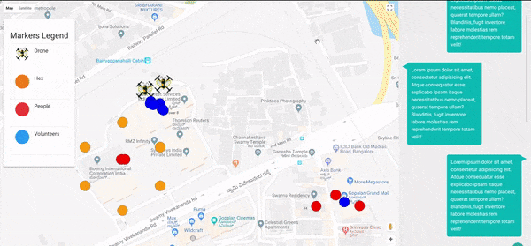

# unSting

End-to-end disaster recovery and management platform using decentralized swarm robotics (autonomous drones) using RTCs powered by agora.io to detect and track people in need of help. This information is relayed by our platform to people who are willing to help. The platform seamlessly integrates volunteers, people in need of help, and other interested parties. 

## Aerial segmentaion Repo Link

[Repository Link](https://github.com/samyak-jain/aseg)

## Drones

## Data dashboard

## Volunteer app

## Components

1. Quadcopters give GPS locations, communicate. Cover area

2. YOLO detects people and agora to stream

3. Move quadcopters in hexagonal structure to maximize area

### Dashboard 1

1. Metrics like volunteer and people location

2. Map

3. Chat interface for interacting with volunteers

### Dashboard 2

1. Fixed map. People pin pointed

2. Chat interface

## Ideas for future use

1. Danger Classification
